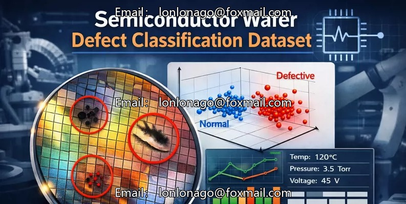
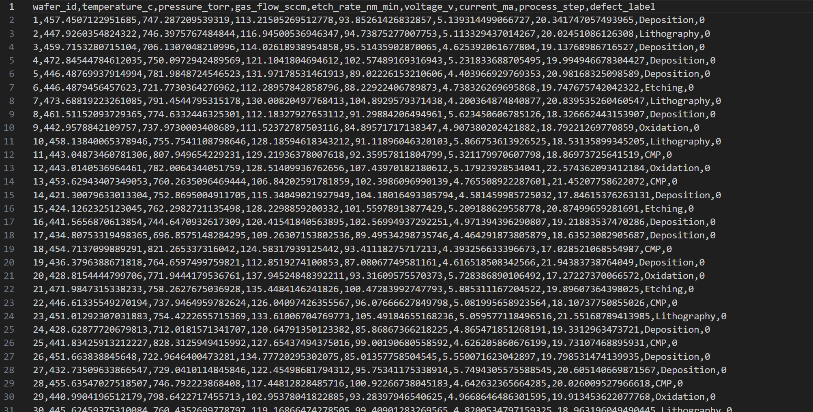

## Body

Silicon Wafer Defect Classification Dataset

Only dataset available

This dataset is a carefully designed industrial-scale real-world scenario based silicon wafer manufacturing dataset, aiming to support industrial machine learning research and practice. It records multi-dimensional sensor readings collected during different manufacturing process steps, along with binary defect labels indicating whether the wafer has passed quality inspection.
The dataset is suitable for both supervised and unsupervised learning tasks, making it highly suitable for experiments, education, and project-level machine learning projects.

Key feature categories include:
Sensor measurement data: Temperature, pressure, gas flow rate, voltage, current, and etching rate
Process metadata: Manufacturing process steps (e.g., etching, photolithography, deposition)
Target variable: Labels used to identify whether the wafer is defective (i.e., distinguishing between defective and non-defective wafers)
Defect labels are generated based on actual abnormal sensor behavior, not randomly assigned, reflecting common industrial fault patterns.
Expected application scenarios, this dataset is very well suited for:
Using machine learning models for defect classification
Performing dimensionality reduction and feature analysis using PCA
Unsupervised anomaly detection (isolation forest, autoencoder, one-class SVM)
Researching feature importance and model interpretability
Teaching and demonstrating industrial machine learning processes

⚠️ Notes
This is a synthetic dataset created specifically for research, learning, and demonstration purposes.
Although these data are not from real manufacturing plants, their distribution and correlation relationships are inspired by real world silicon manufacturing processes.
Not suitable for production or operational decision-making

Electronic virtual products sold without returns or exchanges.

## Images

Here is a pay link on Stripe ( https://buy.stripe.com/3cs8yP7sY87d0vu9AB ). Please contact me lonlonago@foxmail.com after funding $89, and I will send you a complete data files , thank you!

